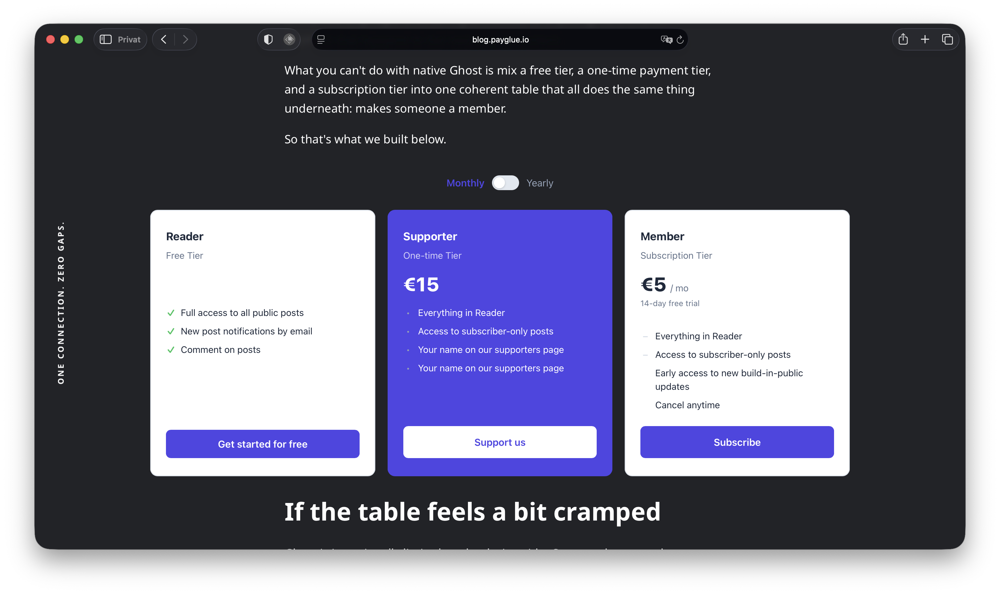
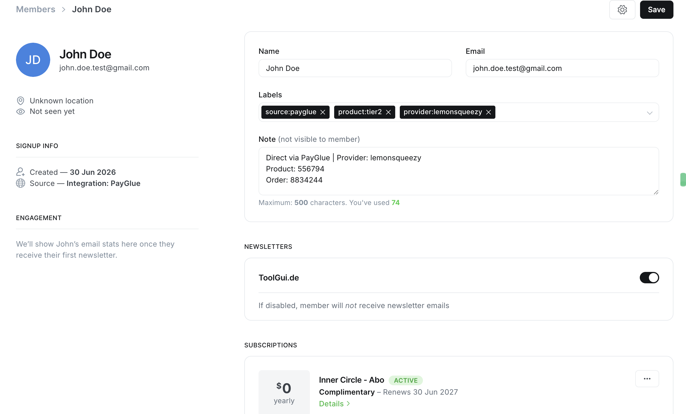
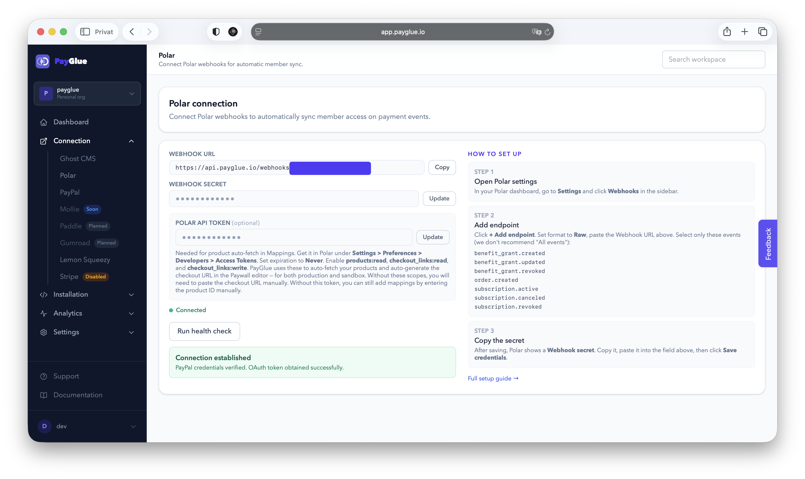
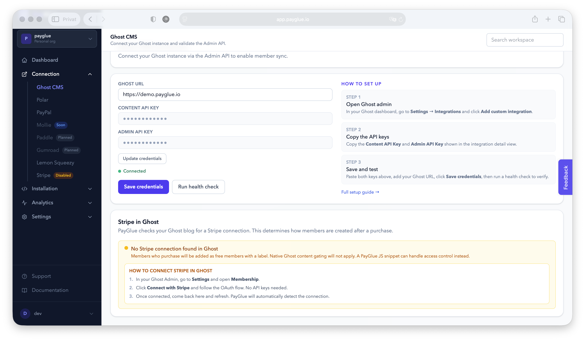

<p align="center">
  
</p>

<h1 align="center">PayGlue-OS</h1>

<p align="center"><b>Sell Ghost memberships with any payment provider, not just Stripe.</b></p>

<p align="center">
  <a href="https://github.com/PayGlue/PayGlue-OS/releases"></a>
  <a href="LICENSE.md"></a>
  
  
  <a href="CONTRIBUTING.md"></a>
</p>

---


## 📝 The Story

I run a several german Ghost blogs and wanted to accept payments through LemonSqueezy, not Stripe. Ghost said no. So I built PayGlue: a relay that receives signed webhooks from your payment provider and syncs membership state into Ghost via the Admin API. Someone pays, they get access. Someone cancels, access is revoked. No Ghost code changes, no manual syncing, no spreadsheet of shame.

**Eight providers, one relay:** Polar · LemonSqueezy · PayPal · Gumroad · Paddle · Ko-fi · Creem · Patreon

Your existing Stripe setup stays untouched. PayGlue runs next to it and only covers what Ghost can't do natively.

> **Status:** Open beta. This repo contains the exact code running the hosted product at [payglue.io](https://payglue.io). Rather not run it yourself? The hosted version is the same code, minus the ops. See the [changelog](CHANGELOG.md) for what changed.

## 👀 See it running before you clone anything

The best pitch is a working paywall. All of these are live, powered by this codebase (yes, we eat our own dog food, it pays our bills):

| Try it | What you'll see |
| --- | --- |
| [The paywall on our own blog](https://blog.payglue.io/how-this-blog-runs-with-a-payglue-paywall/) | Content gating on a real Ghost site, no Stripe connected |
| [A full pricing table inside a Ghost post](https://blog.payglue.io/what-a-full-pricing-table-looks-like-when-it-talks-to-ghost/) | Embedded table with live sandbox checkout |
| [Embedded payment buttons](https://blog.payglue.io/three-buttons-one-dashboard-how-we-embed-payment-links-in-this-blog/) | Three buttons, one dashboard |
| [A production German tech blog](https://go.payglue.io/membership) | PayGlue in the wild, real members, real money |

## ⚙️ How it works

```
Customer pays  →  Provider sends signed webhook  →  PayGlue verifies signature
              →  Maps product to Ghost tier      →  Ghost Admin API updates the member
```

1. Customer buys through any supported provider
2. Provider sends a signed webhook to PayGlue
3. PayGlue verifies the cryptographic signature (HMAC or RSA depending on provider) and maps the product to a Ghost membership tier
4. Ghost Admin API creates or updates the member automatically

<p align="center">
  
</p>

<p align="center">
  
</p>

<p align="center">
  
</p>

## 🚀 Quickstart (self-hosting)

Self-hosting is free, no license fee, no catch. You need Docker, a running Ghost instance, an account with at least one payment provider, and about one coffee's worth of time.

```bash
git clone https://github.com/PayGlue/PayGlue-OS.git
cd PayGlue-OS
cp .env.example .env   # fill in secrets, every variable is annotated
docker compose up -d postgres redis
docker compose run --rm web python manage.py migrate
docker compose up -d
```

Then open the dashboard at `http://localhost:5173`, connect your Ghost site (URL + Admin API key), connect a provider, and map your products to Ghost tiers.

The complete walkthrough, including per-provider setup, auth options, and recommended services for Postgres/Redis/deployment, lives in **[SETUP.md](SETUP.md)**. Full product documentation is at **[docs.payglue.io](https://docs.payglue.io)**, written for the hosted version but the walkthroughs apply to self-hosted installs just the same.

<details>
<summary><b>Stack at a glance</b></summary>

| Layer | Technology |
| --- | --- |
| Frontend | Vue 3 + TypeScript, Cloudflare Pages |
| Backend | Django + Celery, Python 3.12+ |
| Auth | Supabase Auth (ES256 JWT), or any JWKS-compatible issuer |
| Database | PostgreSQL |
| Queue / Cache | Redis |
| Webhook proxy | Cloudflare Workers (included), or any reverse proxy |

No hard dependency on any specific cloud provider. Docker Compose brings up everything locally.

</details>

<details>
<summary><b>Webhook smoke test</b></summary>

```bash
curl -i -X POST "http://localhost:8000/t/your-tenant/webhooks/polar/dev-token/" \
  -H "Content-Type: application/json" \
  -d '{"type":"order.paid","data":{"customer":{"email":"test@example.com"}}}'
# Expected: 202 Accepted
```

</details>

## 🔌 Provider status

Live: **Polar, Lemon Squeezy, PayPal, Gumroad, Paddle, Ko-fi, Creem, Patreon.** Each ships with encrypted credential storage, health checks, webhook signature verification, and product autofetch.

<p align="center">
  
</p>

On hold: **Mollie.** Its recurring model needs per-creator subscription code, which doesn't fit the webhook-relay approach. We tried. Mollie won.

Missing yours? [Open a discussion](https://github.com/PayGlue/PayGlue-OS/discussions). Provider order is largely decided by who asks, so ask.

## 🔐 Security

Two-layer model for inbound webhooks: a URL endpoint token for proxy authentication, plus per-provider cryptographic signature verification (HMAC-SHA256 for Polar and Lemon Squeezy, RSA-SHA256 for PayPal). Credentials are encrypted at rest (AES-256). Boring by design, this thing sits next to your revenue.

Full architecture and vulnerability disclosure process: [SECURITY.md](SECURITY.md)

<p align="center">
  
</p>

## 🤝 Contributing

Contributions are welcome and rewarded, and we mean the second part literally. New provider adapters live in `backend/src/payglue_backend/webhooks/adapters/`, Polar and Lemon Squeezy are the cleanest references to follow. Contributors who want to run PayGlue on their own Ghost site using our infrastructure get a goodie.

Workflow, branch naming, and PR conventions: [CONTRIBUTING.md](CONTRIBUTING.md) · Reach out: team@payglue.io

## 🥚 One more thing

Somewhere in this source code hides a small thank-you for people who actually read it. First finders win. No hints. Happy hunting.

## 📄 License

Business Source License 1.1, converting to Apache 2.0 four years after each version's release. Self-hosting for your own Ghost site is free. Offering PayGlue as a managed service to others requires a commercial license. Details: [LICENSE.md](LICENSE.md)
